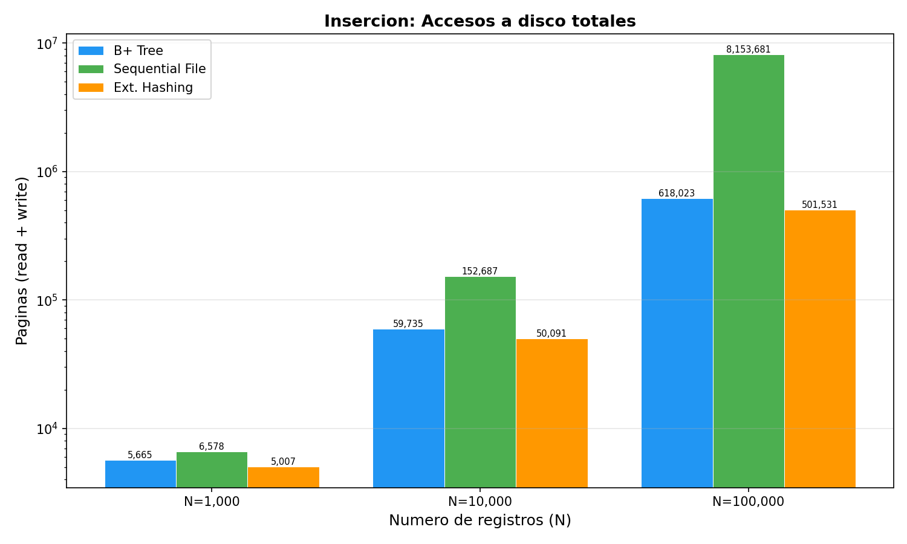
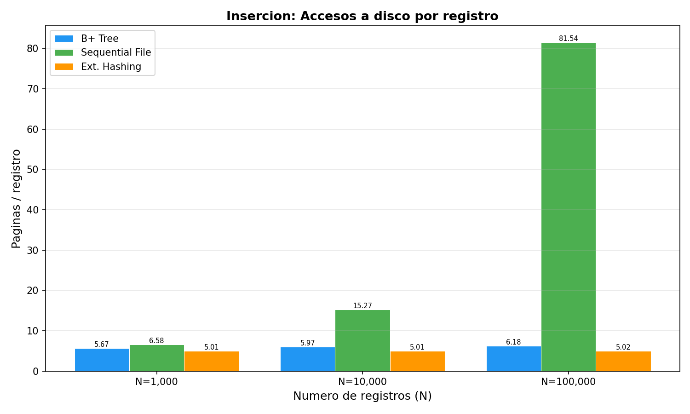
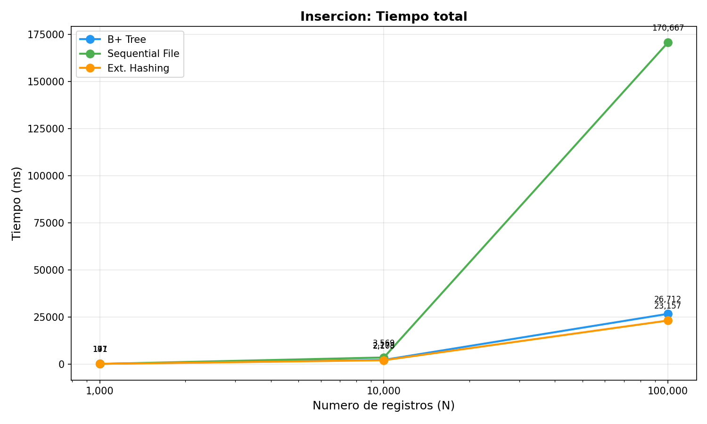
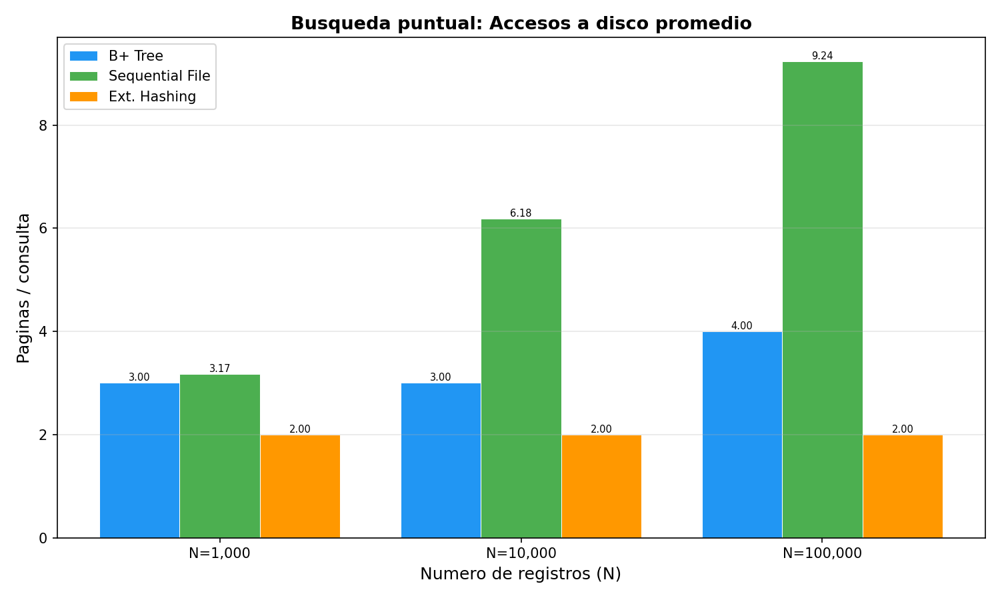
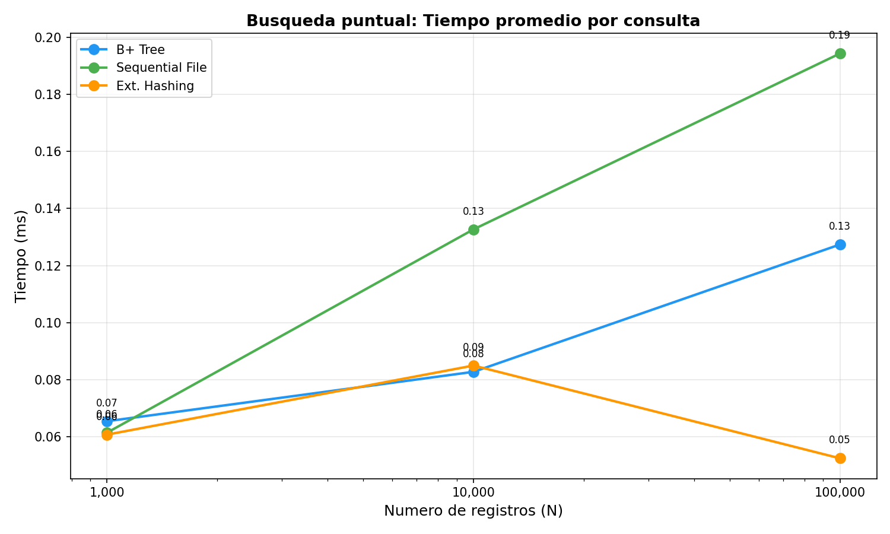
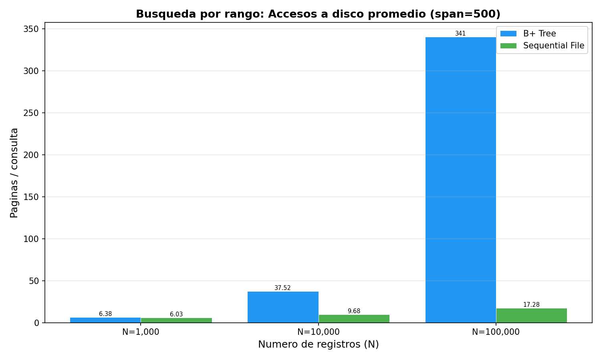
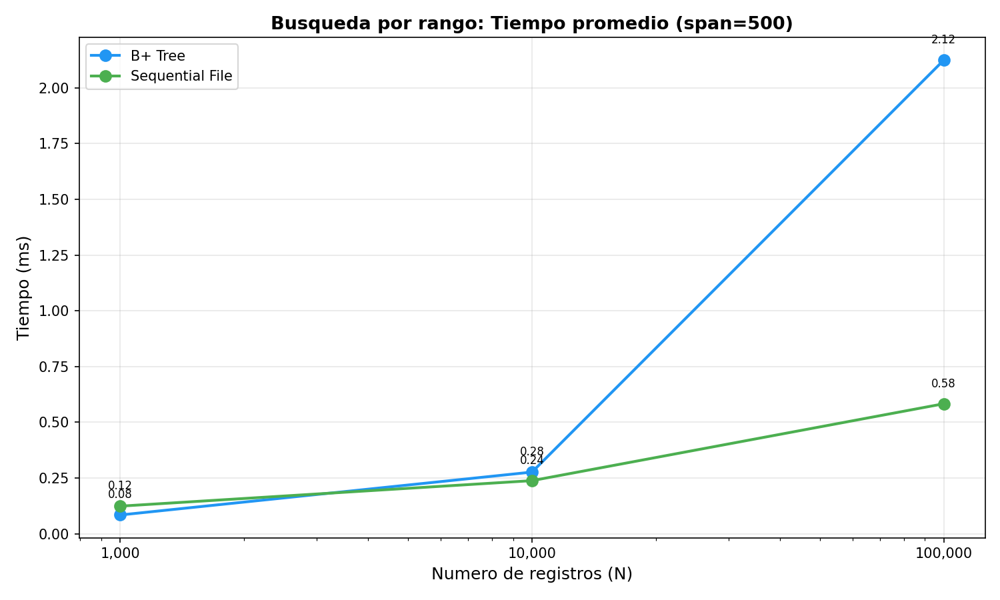

<!-- _class: lead -->

# Mini Sistema de Gestion de Bases de Datos

## Proyecto 1 — Base de Datos II (CS2042)

Universidad de Ingenieria y Tecnologia (UTEC)

---

<!-- _class: section -->

# 1. Arquitectura de Archivos

---

# Arquitectura General

```
SQL Query -> [Scanner] -> [Parser] -> [AST] -> [DBVisitor] -> [DataBase] -> Disco
```

- Todas las estructuras operan sobre **paginas de 4096 bytes** (PageManager)
- Contadores `disk_reads` / `disk_writes` para medir I/O real

**Archivos en disco:**

| Directorio | Contenido | Formato |
|---|---|---|
| `data/*.bin` | Registros (HeapFile) | Paginas de 4096B con slots |
| `indexes/*.idx` | Indices (B+Tree, Hash, RTree, SeqFile) | Paginas de 4096B |
| `schemas/*.json` | Metadata de tablas | JSON |

---

# Clustered vs Unclustered

**Unclustered (por defecto):** HeapFile almacena registros desordenados. Todos los indices son secundarios y apuntan a un RID `(page, slot)` en el heap.

**Clustered (Sequential File como PK):** El Sequential File almacena los registros completos ordenados por la clave primaria. No existe HeapFile. Los indices secundarios apuntan a `(page, slot)` dentro del propio Sequential File.

```sql
-- Unclustered: HeapFile + B+Tree sobre id
CREATE TABLE t (id INT PRIMARY KEY, nombre VARCHAR(50));

-- Clustered: SeqFile ES la tabla, ordenada por id
CREATE TABLE t (id INT INDEX SEQUENTIAL, nombre VARCHAR(50));
```

Cuando el Sequential File se reconstruye, los RIDs cambian y se dispara un **callback** que reconstruye automaticamente los indices secundarios.

---

<!-- _class: section -->

# 2. Parser SQL

---

# Parser — Pipeline

El parser convierte texto SQL en operaciones sobre el motor, en 3 etapas:

```
Texto SQL -> [Scanner] -> Tokens -> [Parser] -> AST -> [DBVisitor] -> Ejecucion
```

- **Scanner**: automata finito que tokeniza (40 palabras reservadas)
- **Parser**: descenso recursivo, una funcion por regla gramatical
- **DBVisitor**: patron Visitor que recorre el AST y llama a `DataBase`

## Operaciones soportadas

| SQL | Accion |
|---|---|
| `CREATE TABLE ... (col TYPE [PRIMARY KEY] [INDEX tech])` | Crea tabla + indices |
| `SELECT ... WHERE col = val / BETWEEN / IN (POINT, RADIUS/K)` | Busqueda + espacial |
| `INSERT INTO ... VALUES (...)` | Insercion |
| `DELETE FROM ... WHERE col = val` | Eliminacion |
| `SELECT ... ORDER BY col` | Ordenamiento externo (TPMMS) |

---

# Parser — Manejo de PRIMARY KEY

```sql
CREATE TABLE empleados (
    id INT PRIMARY KEY,
    salario FLOAT INDEX HASH,
    ubicacion POINT INDEX RTREE
);
```

El parser detecta `PRIMARY KEY` en la definicion de columna:

1. Marca la columna como clave primaria en el schema
2. Se crea automaticamente un **B+ Tree** sobre esa columna (indice por defecto para PK)
3. Todas las operaciones de busqueda por PK usan ese indice
4. Si en vez de `PRIMARY KEY` se usa `INDEX SEQUENTIAL`, la columna se vuelve PK **clustered** (el Sequential File almacena los registros ordenados)

`PRIMARY KEY` garantiza **unicidad**: inserciones duplicadas actualizan el registro existente en vez de insertar uno nuevo.

---

<!-- _class: section -->

# 3. B+ Tree

---

# B+ Tree

Arbol balanceado disk-backed para busquedas por **igualdad y rango**.

## Caracteristica diferenciadora

Las **hojas estan encadenadas** via punteros `next_leaf`. Esto permite recorrer rangos sin volver a subir por el arbol — se navega hoja a hoja secuencialmente.

## Funcionalidades

- **search(key)**: desciende desde la raiz hasta la hoja. **3-4 accesos** para 100K registros
- **rangeSearch(begin, end)**: ubica la hoja de `begin`, luego recorre hojas encadenadas hasta `end`
- **add(key, value)**: inserta ordenado en la hoja. Si desborda: **split** que propaga hacia arriba
- **remove(key)**: elimina de la hoja. Si queda en underflow: **borrow** del hermano o **merge**

## Uso en el proyecto

Indice **por defecto para PRIMARY KEY** (unclustered). Tambien disponible como indice secundario con `INDEX BTREE`.

---

<!-- _class: section -->

# 4. R-Tree

---

# R-Tree

Indice espacial 2D para columnas de tipo **POINT (longitude, latitude)**.

## Caracteristica diferenciadora

Usa **MBRs** (Minimum Bounding Rectangles) en nodos internos para **podar** ramas enteras del arbol que no intersectan la zona de consulta — reduce drasticamente los accesos a disco en consultas localizadas.

## Funcionalidades

- **rangeSearch(point, radio)**: encuentra todos los puntos dentro de un circulo. Usa pila + poda por MBR
- **kNN(point, k)**: k vecinos mas cercanos. Usa **min-heap** priorizado por distancia — explora nodos en orden de cercania
- **add(x, y, rid)**: inserta punto, usa **Quadratic Split** de Guttman si el nodo desborda

## Consultas SQL

```sql
SELECT * FROM locales WHERE ubicacion IN (POINT(-12.04, -77.02), RADIUS 500);
SELECT * FROM locales WHERE ubicacion IN (POINT(-12.04, -77.02), K 5);
```

---

<!-- _class: section -->

# 5. Extendible Hashing

---

# Extendible Hashing

Tabla hash dinamica con directorio expandible para busquedas por **igualdad**.

## Caracteristica diferenciadora

Busqueda en **O(1) constante**: 1 lectura de directorio + 1 lectura de bucket = **2 accesos** independiente de la cantidad de datos. **No soporta busquedas por rango** (las claves se distribuyen por hash, se pierde el orden).

## Funcionalidades

- **search(key)**: hash -> directorio -> bucket. **2 accesos siempre**
- **add(key, value)**: si el bucket desborda, **split** y posible duplicacion del directorio
- **remove(key)**: elimina del bucket. **3 accesos** (read meta + read bucket + write)

## Directorio dinamico

Cuando un bucket se llena y `local_depth == global_depth`, el directorio se **duplica** (2^d -> 2^(d+1) entradas). Multiples entradas pueden apuntar al mismo bucket.

Hash: Knuth multiplicativo `key * 2654435761`, mascara de `global_depth` bits.

---

<!-- _class: section -->

# 6. Concurrencia

---

# Concurrencia — Strict 2PL

Protocolo de control de concurrencia con bloqueos a **nivel de pagina**.

## Tipos de lock

| Lock | Acceso | Compatibilidad |
|---|---|---|
| **SHARED (S)** | Lectura | Multiples TX simultaneas |
| **EXCLUSIVE (X)** | Escritura | Exclusion mutua total |

- **Upgrade S -> X**: permitido solo si la TX es el unico holder
- **Liberacion**: solo en **COMMIT** o **ABORT** (strict 2PL -> serializabilidad)

## Deteccion de deadlocks

Grafo **wait-for** con deteccion de ciclos via BFS:

- TX1 espera lock de TX2, TX2 espera lock de TX1 -> **ciclo detectado**
- TX victima recibe `DeadlockError` y hace **ABORT**, liberando todos sus locks
- Reporte persistido en `logs/concurrency_report.txt` con timeline, conflictos R-W/W-W y deadlocks

---

<!-- _class: section -->

# 7. Resultados Experimentales

---

# Metodologia

- **Dataset**: `cities.csv` — 5 columnas (id, country_id, lat, lon, name)
- **Tamanios**: N = 1,000 / 10,000 / 100,000 registros
- **Metricas**: accesos a disco (paginas 4096B) y tiempo (ms)
- **Consultas**: 200 busquedas puntuales + 200 por rango (span=500)

---

# Insercion — Accesos a disco totales

<div class="result-row">
<div class="col-img">



</div>
<div class="col-table">

| N | B+ Tree | Seq. File | Ext. Hash |
|---|---|---|---|
| 1K | 5,665 | 6,578 | **5,007** |
| 10K | 59,735 | 152,687 | **50,091** |
| 100K | 618,023 | 8,153,681 | **501,531** |

Ext. Hashing: costo constante ~5 accesos/registro

</div>
</div>

---

# Insercion — Accesos por registro

<div class="result-row">
<div class="col-img">



</div>
<div class="col-table">

| N | B+ Tree | Seq. File | Ext. Hash |
|---|---|---|---|
| 1K | 5.67 | 6.58 | **5.01** |
| 10K | 5.97 | 15.27 | **5.01** |
| 100K | 6.18 | 81.54 | **5.02** |

Seq. File crece por reconstrucciones periodicas

</div>
</div>

---

# Insercion — Tiempo total

<div class="result-row">
<div class="col-img">



</div>
<div class="col-table">

| N | B+ Tree | Seq. File | Ext. Hash |
|---|---|---|---|
| 1K | 191 ms | 147 ms | 171 ms |
| 10K | 2,278 ms | 3,569 ms | **2,103 ms** |
| 100K | 26,712 ms | 170,667 ms | **23,157 ms** |

</div>
</div>

---

# Busqueda puntual — Accesos a disco

<div class="result-row">
<div class="col-img">



</div>
<div class="col-table">

| N | B+ Tree | Seq. File | Ext. Hash |
|---|---|---|---|
| 1K | 3.00 | 3.17 | **2.00** |
| 10K | 3.00 | 6.18 | **2.00** |
| 100K | 4.00 | 9.24 | **2.00** |

Ext. Hashing: **2 accesos constantes** siempre

</div>
</div>

---

# Busqueda puntual — Tiempo

<div class="result-row">
<div class="col-img">



</div>
<div class="col-table">

| N | B+ Tree | Seq. File | Ext. Hash |
|---|---|---|---|
| 1K | 0.07 ms | 0.06 ms | 0.06 ms |
| 10K | 0.08 ms | 0.13 ms | 0.09 ms |
| 100K | 0.13 ms | 0.19 ms | **0.05 ms** |

</div>
</div>

---

# Busqueda por rango (span=500) — Accesos a disco

<div class="result-row">
<div class="col-img">



</div>
<div class="col-table">

| N | B+ Tree | Seq. File | Ext. Hash |
|---|---|---|---|
| 1K | 6.38 | **6.03** | N/A (1,065) |
| 10K | 37.52 | **9.68** | N/A (10,011) |
| 100K | 340.73 | **17.28** | N/A (100,039) |

**Seq. File domina**: paginas contiguas = localidad maxima

</div>
</div>

---

# Busqueda por rango (span=500) — Tiempo

<div class="result-row">
<div class="col-img">



</div>
<div class="col-table">

| N | B+ Tree | Seq. File | Ext. Hash |
|---|---|---|---|
| 1K | 0.08 ms | 0.12 ms | N/A |
| 10K | 0.28 ms | 0.24 ms | N/A |
| 100K | 2.12 ms | **0.58 ms** | N/A |

Seq. File: **17 accesos vs 341 del B+ Tree** (100K)

</div>
</div>

---

# Resumen de Resultados

| Operacion | Mejor tecnica | Por que |
|---|---|---|
| Busqueda puntual | **Ext. Hashing** | O(1): 2 accesos constantes |
| Busqueda por rango | **Seq. File** | Paginas contiguas, localidad maxima |
| Insercion | **Ext. Hashing** | ~5 accesos/registro, constante |
| Balance general | **B+ Tree** | Soporta igualdad + rangos, insercion estable |
| Consultas espaciales | **R-Tree** | Unico que soporta radio y k-NN |

**Trade-off clave**: Ext. Hashing es el mas rapido para igualdad pero **no soporta rangos**. B+ Tree es la opcion mas versatil.

---

<!-- _class: section -->

# 8. External Sort (TPMMS)

---

# External Sort — Two-Pass Multiway Merge Sort

Ordenamiento para tablas que **no caben en memoria**. Se activa con `ORDER BY`.

## Funcionamiento

**Fase 1 — Generacion de runs**: lee B paginas a RAM, ordena en memoria, escribe run ordenado a disco

**Fase 2 — Multiway merge**: abre todos los runs simultaneamente, usa un **min-heap** para fusionarlos en orden, produce la salida final ordenada

## Costo I/O

`2P * (1 + ceil(log_{B-1}(ceil(P/B))))` accesos a pagina (P = paginas de la tabla, B = buffer)

## SQL

```sql
SELECT * FROM empleados ORDER BY salario;
```

El DBVisitor detecta `ORDER BY` en el AST y llama a `external_sort()` sobre la tabla, retornando los registros en el orden solicitado.

---

<!-- _class: lead -->

# Gracias

**Mini DBMS — Base de Datos II**
Universidad de Ingenieria y Tecnologia (UTEC)
